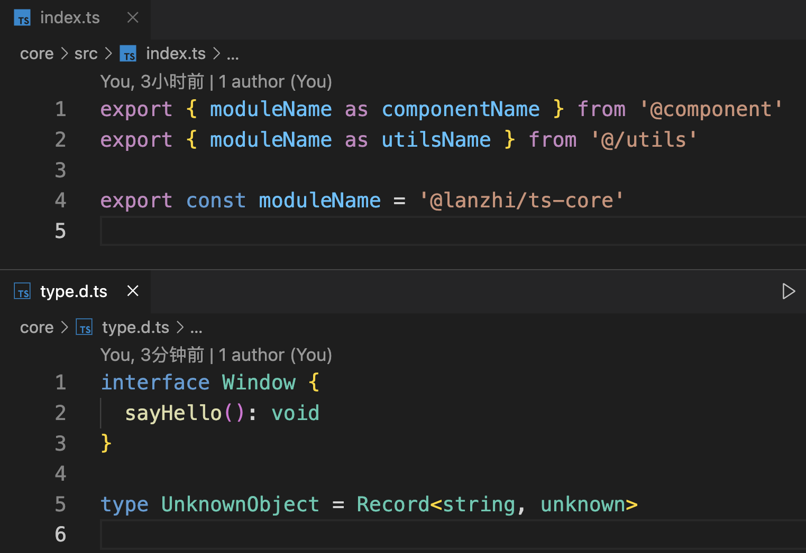
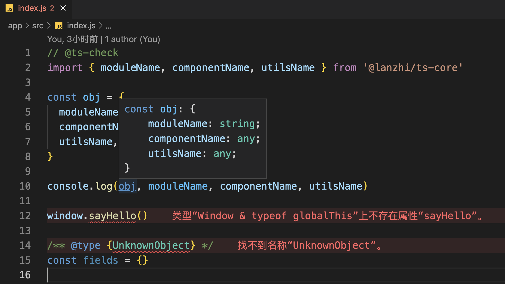
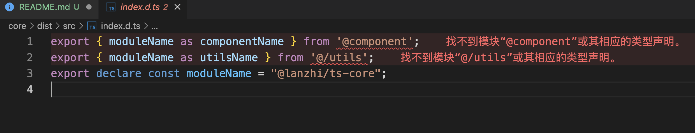
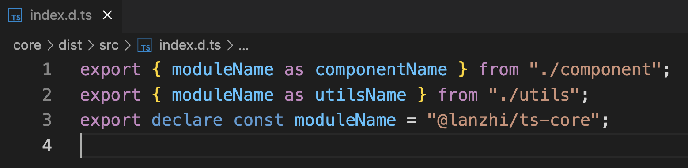
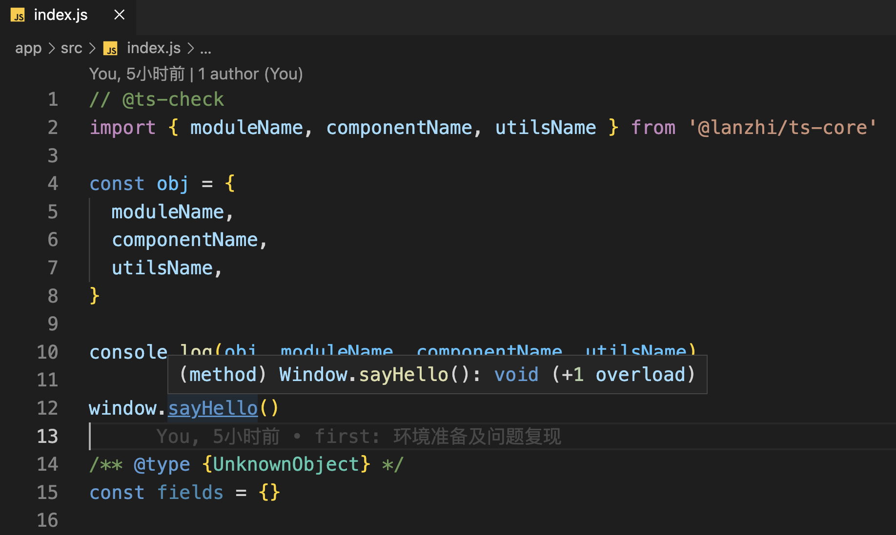

# 如何确保自定义类库中的 TS 类型可用

> 本文是个人在构建 ts 类库时，积累的一些浅薄经验，在此整理以供参考

有以下场景，库的核心代码如下：



实际引用时出现报错：



考虑以下两个问题：

1. 为什么拿不到 componentName 及 utilsName 的类型？
2. 对 window 的全局类型扩展为什么无法生效？

## 环境准备

### 开发环境

```text
nodejs v16.15.1
typescript 4.9.5
pnpm 7.18.2 # 也可换用其他包管理器
```

### 目录结构

在空目录中新建两个文件夹，并添加如下文件

```text
./
├── app                   # 模拟实际应用
│   ├── package.json
│   └── src
│       └── index.js
└── core                  # 模拟自定义类库
    ├── dist
    ├── package.json
    ├── src
    │   ├── component.ts  # 模拟 @name 式的别名
    │   ├── utils.ts      # 模拟 @/ 式的别名
    │   └── index.ts      # 库的主导出入口
    ├── tsconfig.json
    └── type.d.ts         全局类型扩展
```

### 关键配置

#### core/package.json

```jsonc
{
  // 确保文件正确引用
  "main": "dist/src/index.js",
  "types": "dist/src/index.d.ts",
  // 基本的构建命令
  "scripts": {
    "build": "rm -rf ./dist && tsc"
  },
  // 基本依赖
  "devDependencies": {
    "typescript": "~4.9.5"
  }
}
```

#### core/tsconfig.json

```jsonc
{
  // ...其他选项省略
  "compilerOptions": {
    "outDir": "./dist",
    "paths": {
      "@/*": ["src/*"],
      "@component": ["src/component"]
    }
  },
  "include": ["src/**/*", "type.d.ts"],
  "exclude": ["node_modules"]
}
```

#### app/package.json

```json
{
  "dependencies": {
    "@lanzhi/ts-core": "file:../core"
  }
}
```

准备完毕后，命令行进入 core 文件夹中执行 `pnpm build`，构建源代码；进入 app 文件夹执行 `pnpm i`，建立两个文件夹间的链接；随后尝试导入 `@lanzhi/ts-core`库中的代码，即可复现前文提到的问题

## 处理别名引用

> 1. 为什么拿不到 componentName 及 utilsName 的类型？

问题一的原因是，tsc 在执行构建时，并不会自动处理代码中使用的引用别名，如图：



因此需要我们自行处理别名的引用：

- 安装 ttypescript / typescript-transform-paths 两个包

```
pnpm add -D ttypescript typescript-transform-paths
```

- core/tsconfig.json 中增加如下配置

```jsonc
{
  "compilerOptions": {
    "plugins": [
      // 将生成的类型定义文件中的 别名引用 转换为 相对路径引用
      { "transform": "typescript-transform-paths", "afterDeclarations": true }
    ]
  }
}
```

- 构建工具调整为 ttsc

```json
{
  "scripts": {
    "build": "rm -rf ./dist && ttsc"
  }
}
```

重新执行构建脚本，即可解决该问题：



## 处理全局类型定义

> 2. 对 window 的全局类型扩展为什么无法生效？

问题二的原因是 tsc 构建时并不会自动处理工作区的 `.d.ts`文件，需要我们自行将其包含在最终输出的 npm 包中，并在输出的类型入口中添加三斜线指令引用

- package.json 中增加 files 配置

```json
{
  "files": ["dist", "type.d.ts"]
}
```

- core/dist/src/index.d.ts 中新增三斜线指令

```typescript
/// <reference path="../../type.d.ts" />
```

此时回到 app 目录，即可发现该问题已经解决：

> 验证前需要先清理 node_modules



### 脚本自动处理 `.d.ts` 文件

上一节中我们仅有 `type.d.ts`一个文件，因此可以通过 `files`字段进行包含，若内部有较多 `.d.ts`文件，则需要手动编写构建脚本

- 安装 [zx](https://github.com/google/zx)

> zx 帮助我们通过 js 组织胶水代码，相当于 shell 脚本的替代

```bash
pnpm add -D zx
```

- 编写脚本`build.mjs`如下：

> .mjs 为使用 es6 语法的 nodejs 脚本

```js
// @ts-check
import { $, fs, globby } from 'zx'

await main()

async function main() {
  await $`npx ttsc`
  await copyDts()
}

async function copyDts() {
  const dtsList = ['../../type.d.ts']

  // 扫描内部目录中的类型定义文件并自动复制至目标文件夹
  await globby('src/**/*.d.ts').then(async (declarationFiles) => {
    for await (const filePath of declarationFiles) {
      await $`cp ${filePath} ./dist/${filePath}`
      dtsList.push(filePath.replace('src/', ''))
    }
  })

  // 向类型定义文件的入口插入 dts 的引入
  const dtsStr = dtsList.map((dts) => `/// <reference path="${dts}" />`).join('\n') + '\n\n'
  const typesEntry = './dist/src/index.d.ts'
  fs.writeFileSync(typesEntry, Buffer.concat([Buffer.from(dtsStr), fs.readFileSync(typesEntry)]))
}
```

- 更新构建脚本

```json
{
  "scripts": {
    "build": "rm -rf ./dist && node ./build.mjs"
  }
}
```

# 参考链接

- [ttypescript](https://github.com/cevek/ttypescript/tree/master/packages/ttypescript)
- [typescript-transform-paths](https://github.com/LeDDGroup/typescript-transform-paths)
- [zx](https://github.com/google/zx)